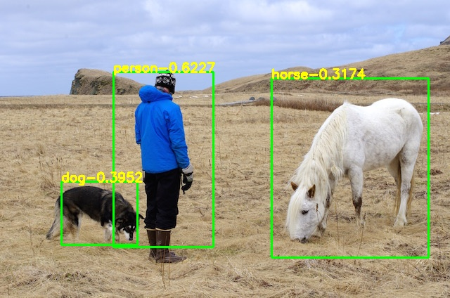

# YOLOV1_PyTorch
yolov1 to pytorch

# Demo

# 中文解读
[传送门](https://blog.csdn.net/samylee/article/details/132335049?spm=1001.2014.3001.5501)

# Model
[extraction.weights](http://pjreddie.com/media/files/yolov1/tiny-yolov1.weights)

# Reference
https://pjreddie.com/darknet/yolov1/
https://github.com/AlexeyAB/darknet  
https://blog.csdn.net/samylee
